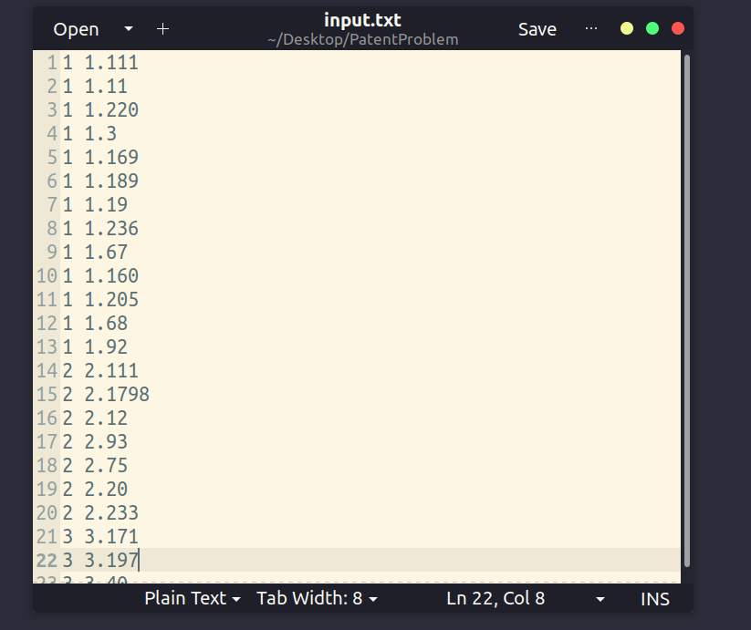
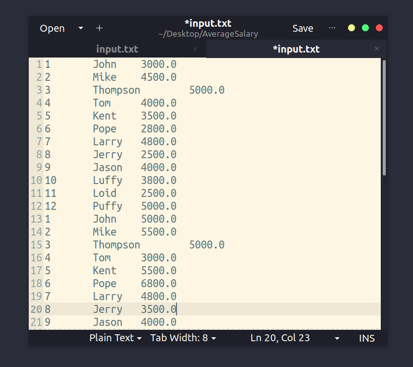
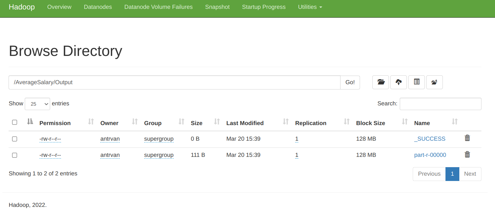
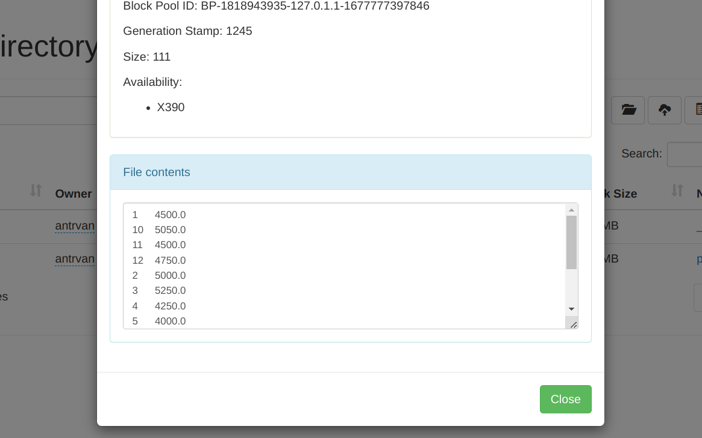
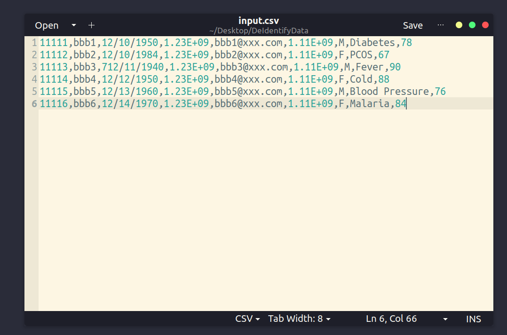
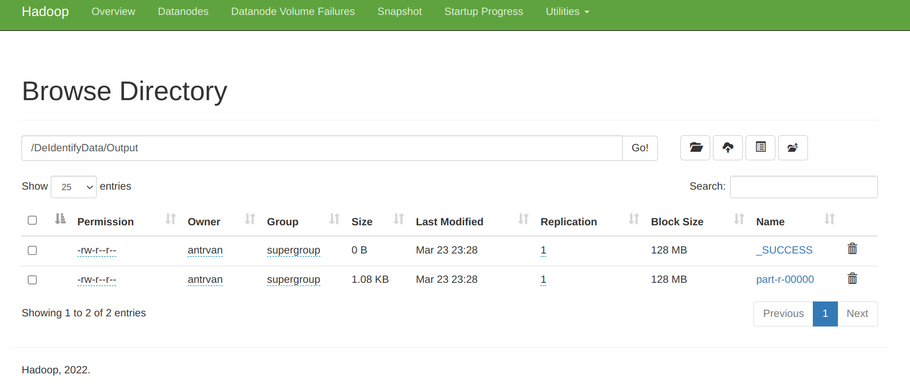
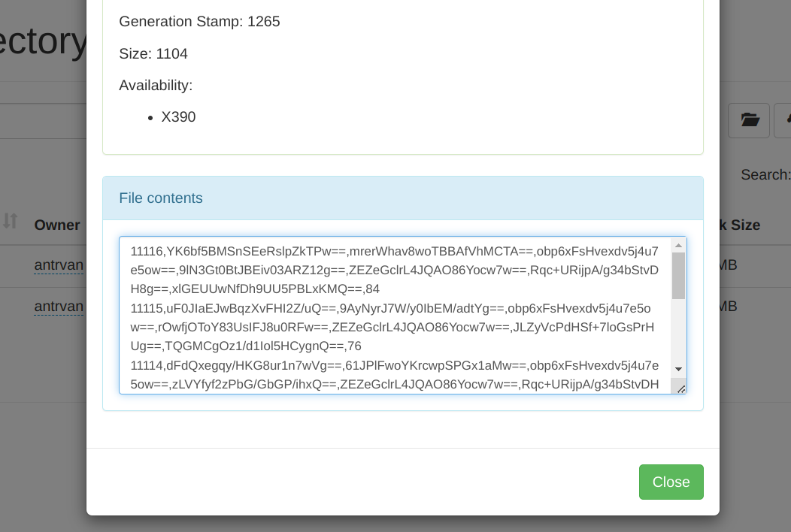
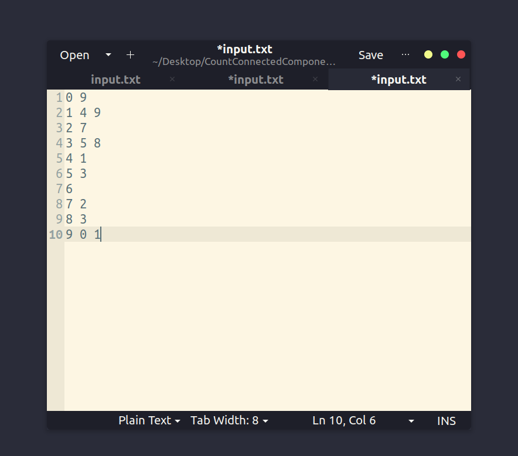
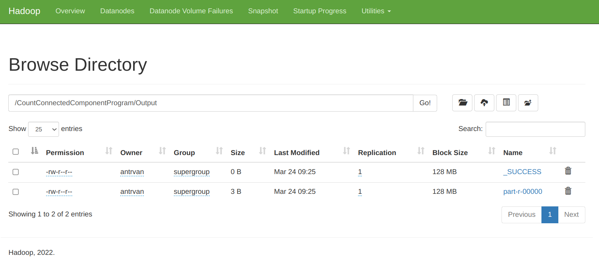
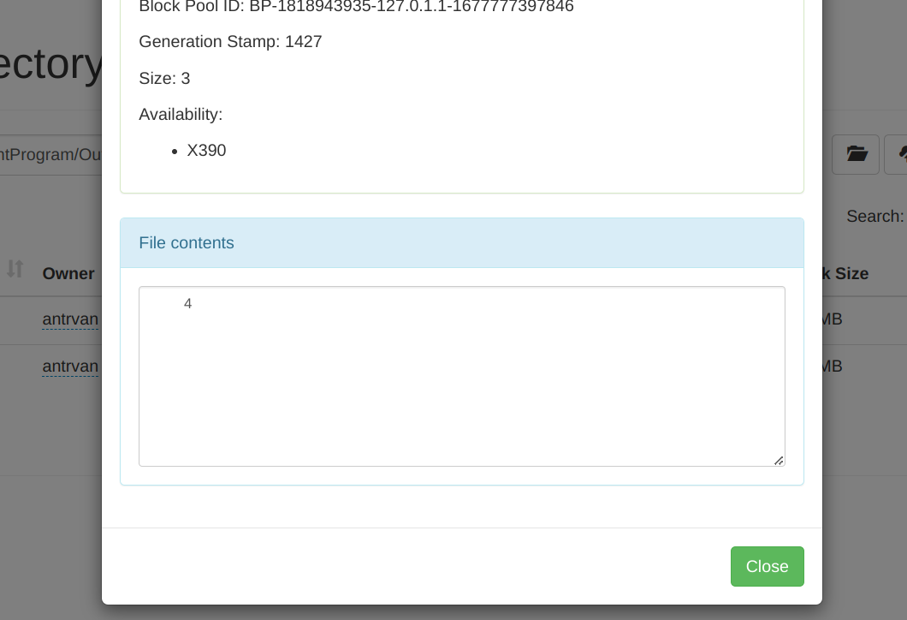

# Lab 02: Map Reduce Programming


## 4. Patent Program


### Step 1: Program's solution

+ Mapper:

```java
    public static class PatentMapper
            extends Mapper<Object, Text, Text, Text> {
        Text k = new Text();
        Text v = new Text();

        public void map(Object key, Text value, Context context) throws IOException, InterruptedException {
            String line = value.toString();

            StringTokenizer tokenizer = new StringTokenizer(line, " ");
            while (tokenizer.hasMoreTokens()) {
                String token = tokenizer.nextToken();
                k.set(token);
                String token1 = tokenizer.nextToken();
                v.set(token1);
                context.write(k, v);
            }
        }
    }
```

+ Reducer:

```java
    public static class SumSubPatentReducer
            extends Reducer<Text, Text, Text, Text> {

        public void reduce(Text key, Iterable<Text> values,
                           Context context) throws IOException, InterruptedException {
            int sum = 0;
            for (Text x : values) {
                sum++;
            }
            String result = Integer.toString(sum);
            context.write(key, new Text(result));
        }
    }
```

+ Main:

```java
    public static void main(String[] args) throws Exception {
        Configuration conf = new Configuration();
        Job job = Job.getInstance(conf, "patent program");
        job.setJarByClass(PatentProgram.class);

        job.setMapperClass(PatentMapper.class);
        job.setReducerClass(SumSubPatentReducer.class);

        job.setOutputKeyClass(Text.class);
        job.setOutputValueClass(Text.class);

        FileInputFormat.addInputPath(job, new Path(args[0]));
        FileOutputFormat.setOutputPath(job, new Path(args[1]));
        System.exit(job.waitForCompletion(true) ? 0 : 1);
    }
```

+ The main idea for this program is that collecting pair of token in Map function, after combining, we count them through the their key and write in output file.

### Step 2: Class Creation

+ After complete code in Java, we need to generate file jar from builded classes by below command:

```bash
jar -cvf PatentProgram.jar -C classes/ .
```

+ Notice: Make sure that you export HADOOP_CLASSPATH before buiding file jar


### Step 3: Create directory structure for program in Hadoop

+ We need to create folder to store input data in HDFS by below command: 

```bash
hadoop fs -mkdir /PatentProgram
hadoop fs -mkdir /PatentProgram/Input
hadoop fs -put "local input file's path" /PatentProgram/Input
```

+ Example input:

+ 

### Step 4: Create Jar File and deploy it to Hadoop

```bash
hadoop jar "Path to your local file .jar" PatentProgram /PatentProgram/Input /PatentProgram/Output
```

### Step 5: Final result

+ After succesfully calculating, we can check our result in HDFS like below: 

+ 

+ 


## 6. AverageSalary Program

### Step 1: Program's solution

+ Mapper:
```java
    public static class AvgMapper
            extends Mapper<Object, Text, Text, FloatWritable> {

        private Text id = new Text();
        private FloatWritable salary = new FloatWritable();

        public void map(Object key, Text value, Context context) throws IOException, InterruptedException {
            String[] values = value.toString().split("\t");
            id.set(values[0]);

            salary.set(Float.parseFloat(values[2]));
            context.write(id, salary);
        }
    }
```

+ Reducer

```java
    public static class AvgReducer
            extends Reducer<Text, FloatWritable, Text, FloatWritable> {

        private FloatWritable result = new FloatWritable();

        public void reduce(Text key, Iterable<FloatWritable> values,
                           Context context) throws IOException, InterruptedException {
            float totalSalary = 0;
            int numberPersons = 0;
            for (FloatWritable salary : values) {
                totalSalary += salary.get();
                numberPersons++;
            }

            result.set(totalSalary/numberPersons);
            context.write(key, result);
        }
    }
```

+ Main

```java
    public static void main(String[] args) throws Exception {
        Configuration conf = new Configuration();
        Job job = Job.getInstance(conf, "average salary");
        job.setJarByClass(AverageSalary.class);

        job.setMapperClass(AvgMapper.class);
        job.setReducerClass(AvgReducer.class);

        job.setOutputKeyClass(Text.class);
        job.setOutputValueClass(FloatWritable.class);

        FileInputFormat.addInputPath(job, new Path(args[0]));
        FileOutputFormat.setOutputPath(job, new Path(args[1]));
        System.exit(job.waitForCompletion(true) ? 0 : 1);
    }
```

+ In Map function, we will collect employee's ID with their salary to make a pair. Then in Reducer, we will take average salary of each employee's ID to write in the output. 


### Step 2: Class Creation

+ After complete code in Java, we need to generate file jar from builded classes by below command:

```bash
jar -cvf AverageSalary.jar -C classes/ .
```

+ Notice: Make sure that you export HADOOP_CLASSPATH before buiding file jar

### Step 3: Create directory structure for program in Hadoop

+ We need to create folder to store input data in HDFS by below command: 

```bash
hadoop fs -mkdir /AverageSalary
hadoop fs -mkdir /AverageSalary/Input
hadoop fs -put "local input file's path" /AverageSalary/Input
```

+ Example input:

+ 


### Step 4: Create Jar File and deploy it to Hadoop

```bash
hadoop jar "Path to your local file .jar" AverageSalary /AverageSalary/Input /AverageSalary/Output
```

### Step 5: Final result

+ After succesfully calculating, we can check our result in HDFS like below: 

+ 

+ 

## 7.  De Identify HealthCare Program

### Step 3: Program's solution

+ Mapper
```java
    public static Integer[] encryptCol = {2, 3, 4, 5, 6, 7, 8};
    private static byte[] key1 = new String("sampleKey1234567").getBytes();

    public static class Map
            extends Mapper<Object, Text, NullWritable, Text> {

        public void map(Object key, Text value, Context context) throws IOException, InterruptedException {
            StringTokenizer tokenizer = new StringTokenizer(value.toString(), ",");
            List<Integer> list = new ArrayList<>();

            Collections.addAll(list, encryptCol);
            // list = {2, 3, 4, 5, 6, 7, 8}

            System.out.println("Mapper :: one" + value);
            String newStr = "";

            int counter = 1;

            while (tokenizer.hasMoreTokens()) {
                String token = tokenizer.nextToken();
                System.out.println("token" + token);
                System.out.println("i=" + counter);

                if (list.contains(counter)) {
                    if (newStr.length() > 0) {
                        newStr += ",";
                    }
                    newStr += encrypt(token, key1);
                }
                else {
                    if (newStr.length() > 0) {
                        newStr += ",";
                    }
                    newStr += token;
                }
                counter += 1;
            }

            context.write(NullWritable.get(), new Text(newStr.toString()));
        }
    }
```

+ Encrypt function
```java
    public static String encrypt(String strToEncrypt, byte[] key)
    {
        try
        {
            Cipher cipher = Cipher.getInstance("AES/ECB/PKCS5Padding");
            SecretKeySpec secretKey = new SecretKeySpec(key, "AES");
            cipher.init(Cipher.ENCRYPT_MODE, secretKey);

            String encryptedString = Base64.encodeBase64String(cipher.doFinal(strToEncrypt.getBytes()));

            return encryptedString.trim();
        }
        catch (Exception e)
        {
            logger.error("Error while encrypting", e);
        }
        return null;
    }
```

+ Main

```java
    public static void main(String[] args) throws Exception {
        if (args.length != 2) {
            System.out.println("usage: [input] [output]");
            System.exit(-1);
        }

        Configuration conf = new Configuration();
        Job job = Job.getInstance(conf, "de identify data");
        job.setMapperClass(Map.class);

        job.setInputFormatClass(TextInputFormat.class);
        job.setOutputFormatClass(TextOutputFormat.class);

        job.setOutputKeyClass(NullWritable.class);
        job.setOutputValueClass(Text.class);

        FileInputFormat.setInputPaths(job, new Path(args[0]));
        FileOutputFormat.setOutputPath(job, new Path(args[1]));

        job.setJarByClass(DeIdentifyData.class);
        job.waitForCompletion(true);
    }
```

+ The idea to resolve this question is only using Map function and encrypt function to encrypt data in identified columns which need to be hidden. 

### Step 2: Class Creation

+ After complete code in Java, we need to generate file jar from builded classes by below command:

```bash
jar -cvf DeIdentifyData.jar -C classes/ .
```

+ Notice: Make sure that you export HADOOP_CLASSPATH before buiding file jar


### Step 3: Create directory structure for program in Hadoop

+ We need to create folder to store input data in HDFS by below command: 

```bash
hadoop fs -mkdir /DeIdentifyData
hadoop fs -mkdir /DeIdentifyData/Input
hadoop fs -put "local input file's path" /DeIdentifyData/Input
```

+ Example input:

+ 

### Step 4: Create Jar File and deploy it to Hadoop

```bash
hadoop jar "Path to your local file .jar" DeIdentifyData /DeIdentifyData/Input /DeIdentifyData/Output
```

### Step 5: Final result

+ After succesfully calculating, we can check our result in HDFS like below: 

+ 

+ 

## 10. Count Connected Components Program


### Step 1: Program's solution

+ Mapper

```java
    public static class Map
            extends Mapper<Object, Text, Text, Text> {

        public void map(Object key, Text value, Context context
        ) throws IOException, InterruptedException {
            String[] tokens = value.toString().split(" ");

            String keyValue = tokens[0];
            Arrays.sort(tokens);

            int i = 0;
            while (i < tokens.length) {
                context.write(new Text("map"), new Text(keyValue + "," + tokens[i]));
                i++;
            }
        }
    }
```

+ Reducer

```java
    public static class Reduce
            extends Reducer<Text, Text, Text, Text> {

        public void reduce(Text key, Iterable<Text> values,
                           Context context
        ) throws IOException, InterruptedException {

            TreeMap<Integer, ArrayList<Integer>> sortedMap = new TreeMap<>();
            HashMap<Integer, Integer> result = new HashMap<>();
            for (Text value : values) {
                String[] pair = value.toString().split(",");

                int keyItem = Integer.parseInt(pair[0]);
                int valueItem = Integer.parseInt(pair[1]);

                ArrayList<Integer> tmp = sortedMap.getOrDefault(keyItem, new ArrayList<Integer>());
                tmp.add(valueItem);
                Collections.sort(tmp);
                sortedMap.put(keyItem, tmp);
            }

            for (Integer k : sortedMap.keySet()) {
                Integer start = sortedMap.get(k).get(0);
                if (start.compareTo(k) == 0) {
                    result.put(k, k);
                }
                if (start.compareTo(k) < 0) {
                    result.put(k, result.get(start));
                    for (Integer v : sortedMap.get(k)) {
                        if (v.equals(start)) continue;
                        for (Integer j : result.keySet()) {
                            if (result.get(j).equals(v)) {
                                result.replace(j, v, start);
                            }
                        }
                    }
                }
            }

            HashSet<Integer> components = new HashSet<>();
            boolean b = components.addAll(result.values());

            if (b) {
                context.write(new Text(""), new Text(String.valueOf(components.size())));
            }
        }
    }
```

+ Main

```java
    public static void main(String[] args) throws Exception {
        Configuration conf = new Configuration();
        Job job = Job.getInstance(conf, "count connected component program");

        job.setJarByClass(CountConnectedComponentProgram.class);

        job.setMapperClass(Map.class);
        job.setReducerClass(Reduce.class);

        job.setOutputKeyClass(Text.class);
        job.setOutputValueClass(Text.class);

        FileInputFormat.addInputPath(job, new Path(args[0]));
        FileOutputFormat.setOutputPath(job, new Path(args[1]));
        System.exit(job.waitForCompletion(true) ? 0 : 1);
    }
```

+ This task is an intriguing question that calculate numbers of separated components in a graph. To resolve this problem, we put pair of source and destination point of every edges in graph to reducer. We put all pairs to TreeMap to sort them. Then in each components, we mark all connected vertices value to smallest vertex. Finally, the result equals numbers of different values in HashMap.   


### Step 2: Class Creation

+ After complete code in Java, we need to generate file jar from builded classes by below command:

```bash
jar -cvf CountConnectedComponentProgram.jar -C classes/ .
```

+ Notice: Make sure that you export HADOOP_CLASSPATH before buiding file jar


### Step 3: Create directory structure for program in Hadoop

+ We need to create folder to store input data in HDFS by below command: 

```bash
hadoop fs -mkdir /CountConnectedComponentProgram
hadoop fs -mkdir /CountConnectedComponentProgram/Input
hadoop fs -put "local input file's path" /CountConnectedComponentProgram/Input
```

+ Example input:

+ 


### Step 4: Create Jar File and deploy it to Hadoop

```bash
hadoop jar "Path to your local file .jar" CountConnectedComponentProgram /CountConnectedComponentProgram/Input /CountConnectedComponentProgram/Output
```


### Step 5: Final result

+ After succesfully calculating, we can check our result in HDFS like below: 

+ 

+ 


## Self-reflection

### 20127435 - Tran Van An

+ After completing above tasks, I know more about the useful of MapReduce in handle real-problems in many aspects as well as get experiences in MapReduce Programing for the midterm test.


## Member's contribution

Task | Result
----------------------------------------|----------
4.PatentProgram                         | 100%
6.Average Salary                        | 100%
7.De Identify Data                      | 100%
10.Count Connected Components           | 100%


MSSV | Member | Contribution Percentage
-----|------------------|---------------
20127435 | Tran Van An       | 25%
20127395 | Phan Minh Xuan    | 25%
20127032 | Bui Gia Huy       | 25%
20127631 | Thai Van Thien    | 25%

## References


